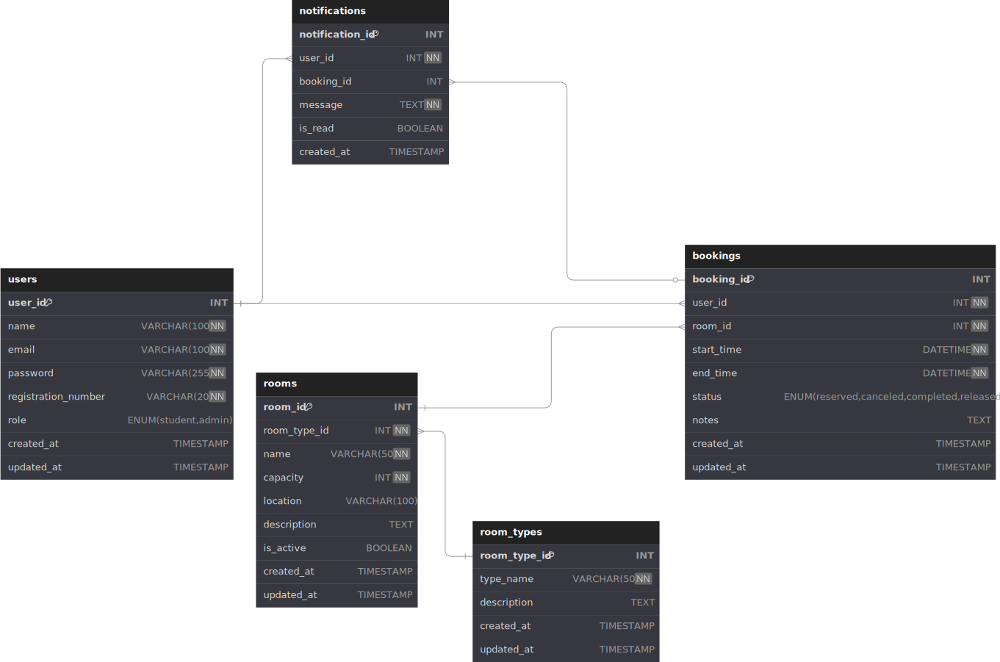

# Documento de Arquitetura Web (WAD)

## Sistema de Reserva de Salas - Inteli

## Índice

1. [Introdução](#introdução)
   - [Objetivos do Sistema](#objetivos-do-sistema)
   - [Escopo](#escopo)
   - [Público-alvo](#público-alvo)
2. [Arquitetura do Sistema](#arquitetura-do-sistema)
   - [Estrutura do Projeto](#estrutura-do-projeto)
   - [Padrão MVC](#padrão-mvc)
   - [Tecnologias Utilizadas](#tecnologias-utilizadas)
3. [Banco de Dados](#banco-de-dados)
   - [Configuração PostgreSQL](#configuração-postgresql)
   - [Modelo de Dados](#modelo-de-dados)
   - [Estrutura das Tabelas](#estrutura-das-tabelas)
4. [API REST](#api-rest)
   - [Endpoints](#endpoints)
   - [Modelos de Dados](#modelos-de-dados)
   - [Regras de Negócio](#regras-de-negócio)
5. [Interface do Usuário](#interface-do-usuário)
   - [Design Responsivo](#design-responsivo)
   - [Componentes](#componentes)
   - [Interatividade](#interatividade)
6. [Aspectos Técnicos](#aspectos-técnicos)
   - [Segurança](#segurança)
   - [Performance](#performance)
   - [Testes](#testes)
   - [Monitoramento](#monitoramento)
7. [Implantação e Manutenção](#implantação-e-manutenção)
   - [Deployment](#deployment)
   - [Manutenção](#manutenção)
8. [Próximos Passos](#próximos-passos)

## Introdução

O Sistema de Reserva de Salas do Inteli é uma aplicação web desenvolvida para atender às necessidades específicas da comunidade acadêmica do Instituto de Tecnologia e Liderança. O sistema permite que os estudantes reservem espaços de estudo no campus, que inclui salas de estudo e cabines para chamadas de vídeo.

### Objetivos do Sistema

- Facilitar o agendamento de salas de estudo e cabines para os estudantes
- Permitir reservas com duração flexível entre 15 minutos e 2 horas
- Possibilitar a liberação antecipada de salas quando não estiverem mais em uso
- Fornecer feedback em tempo real sobre a disponibilidade dos espaços
- Melhorar a utilização dos recursos de estudo disponíveis no campus
- Fornecer uma API RESTful completa para integração com outros sistemas
- Oferecer uma interface moderna e responsiva
- Implementar um dashboard com estatísticas em tempo real
- Garantir uma experiência de usuário intuitiva e eficiente

### Escopo

O sistema gerencia o processo completo de reserva de salas através de uma API RESTful e interface web, implementando:

- Gerenciamento de usuários (estudantes e administradores)
- Gerenciamento de salas e seus tipos
- Sistema de reservas com verificação de disponibilidade
- Controle de status das reservas (reservada, aprovada, rejeitada, cancelada, concluída, liberada)
- Dashboard com estatísticas em tempo real
- Interface responsiva e moderna
- Sistema de notificações para status de reservas
- Suporte a múltiplos tipos de salas e equipamentos

### Público-alvo

- Estudantes do Inteli que necessitam de espaços para estudo e reuniões
- Administradores do sistema responsáveis pela gestão dos espaços
- Desenvolvedores que precisam integrar com o sistema via API

## Arquitetura do Sistema

### Estrutura do Projeto

```
reserva-salas/
├── src/
│   ├── config/         # Configurações do projeto
│   │   └── db.js       # Configuração do banco de dados
│   ├── controllers/    # Controladores da aplicação
│   ├── models/         # Modelos de dados
│   ├── repositories/   # Repositórios para acesso ao banco
│   ├── routes/         # Rotas da API
│   ├── views/          # Templates EJS
│   │   ├── pages/     # Páginas principais
│   │   ├── partials/  # Componentes reutilizáveis
│   │   └── errors/    # Páginas de erro
│   └── server.js       # Arquivo principal
├── public/             # Arquivos estáticos
│   ├── css/           # Estilos
│   ├── images/        # Imagens e ícones
│   └── js/            # Scripts do cliente
├── docs/              # Documentação adicional
└── tests/             # Testes automatizados
```

### Padrão MVC

O sistema segue o padrão Model-View-Controller (MVC) com algumas adaptações para uma API RESTful e interface web:

1. **Models** (`src/models/`)

   - Definem a estrutura dos dados
   - Implementam validações básicas
   - Fornecem métodos para serialização/deserialização
   - Classes: `Usuario`, `Sala`, `Reserva`, `TipoSala`

2. **Controllers** (`src/controllers/`)

   - Implementam a lógica de negócio
   - Processam requisições HTTP
   - Validam dados de entrada
   - Gerenciam respostas e erros
   - Classes: `UsuarioController`, `SalaController`, `ReservaController`, `TipoSalaController`

3. **Repositories** (`src/repositories/`)

   - Camada adicional para abstração do banco de dados
   - Implementam operações CRUD
   - Gerenciam queries SQL
   - Classes: `UsuarioRepository`, `SalaRepository`, `ReservaRepository`, `TipoSalaRepository`

4. **Views** (`src/views/`)

   - Templates EJS para renderização do frontend
   - Componentes reutilizáveis
   - Páginas de erro personalizadas
   - Estrutura organizada em páginas e partials

5. **Routes** (`src/routes/`)
   - Definem endpoints da API
   - Mapeiam URLs para controllers
   - Implementam middleware quando necessário
   - Arquivos: `usuarios.js`, `salas.js`, `reservas.js`, `tipos-sala.js`, `index.js`

### Tecnologias Utilizadas

- **Backend**: Node.js, Express
- **Frontend**: EJS, CSS3, JavaScript
- **Banco de Dados**: PostgreSQL
- **ORM**: pg (node-postgres)
- **Testes**: Jest
- **Documentação**: Markdown, OpenAPI (em desenvolvimento)

## Banco de Dados

### Configuração PostgreSQL

O sistema foi desenvolvido utilizando PostgreSQL como banco de dados relacional. A implementação atual utiliza o Supabase como serviço de banco de dados, mas o sistema é flexível e pode ser configurado para usar qualquer instância PostgreSQL, incluindo instalações locais.

Para usar uma instância local do PostgreSQL, configure as variáveis no arquivo `.env`:

```env
DB_HOST=localhost
DB_PORT=5432
DB_NAME=nome_do_banco
DB_USER=seu_usuario
DB_PASSWORD=sua_senha
```

O sistema utiliza a biblioteca `pg` (node-postgres) para conexão com o banco de dados, que é compatível com qualquer instância PostgreSQL padrão. A única diferença entre usar Supabase ou uma instância local está na configuração das variáveis de ambiente.

### Modelo de Dados

O modelo de dados do sistema pode ser visualizado através dos seguintes arquivos:

- **Modelo Interativo**: [`public/images/modelo-banco.svg`](../public/images/modelo-banco.svg) - Diagrama interativo em formato SVG
- **Modelo em PDF**: [`public/files/modelo-banco.pdf`](../public/files/modelo-banco.pdf) - Versão em PDF



### Estrutura das Tabelas

1. **users**

   ```sql
   CREATE TABLE users (
     user_id SERIAL PRIMARY KEY,
     name VARCHAR(100) NOT NULL,
     email VARCHAR(100) UNIQUE NOT NULL,
     password VARCHAR(255) NOT NULL,
     role VARCHAR(20) NOT NULL,
     registration_number VARCHAR(20) UNIQUE NOT NULL,
     is_active BOOLEAN DEFAULT true,
     created_at TIMESTAMP DEFAULT CURRENT_TIMESTAMP,
     updated_at TIMESTAMP DEFAULT CURRENT_TIMESTAMP
   );
   ```

2. **room_types**

   ```sql
   CREATE TABLE room_types (
     room_type_id SERIAL PRIMARY KEY,
     type_name VARCHAR(50) NOT NULL UNIQUE,
     description TEXT,
     is_active BOOLEAN DEFAULT true,
     created_at TIMESTAMP DEFAULT CURRENT_TIMESTAMP,
     updated_at TIMESTAMP DEFAULT CURRENT_TIMESTAMP
   );
   ```

3. **rooms**

   ```sql
   CREATE TABLE rooms (
     room_id SERIAL PRIMARY KEY,
     name VARCHAR(50) NOT NULL UNIQUE,
     capacity INTEGER NOT NULL,
     room_type_id INTEGER REFERENCES room_types(room_type_id),
     location VARCHAR(100),
     description TEXT,
     is_active BOOLEAN DEFAULT true,
     created_at TIMESTAMP DEFAULT CURRENT_TIMESTAMP,
     updated_at TIMESTAMP DEFAULT CURRENT_TIMESTAMP
   );
   ```

4. **bookings**
   ```sql
   CREATE TABLE bookings (
     booking_id SERIAL PRIMARY KEY,
     room_id INTEGER REFERENCES rooms(room_id),
     user_id INTEGER REFERENCES users(user_id),
     start_time TIMESTAMP NOT NULL,
     end_time TIMESTAMP NOT NULL,
     status VARCHAR(20) NOT NULL,
     reason TEXT,
     created_at TIMESTAMP DEFAULT CURRENT_TIMESTAMP,
     updated_at TIMESTAMP DEFAULT CURRENT_TIMESTAMP
   );
   ```

## API REST

### Endpoints

#### Usuários

- `GET /usuarios` - Lista todos os usuários
- `GET /usuarios/:user_id` - Busca usuário por ID
- `POST /usuarios` - Cria novo usuário
- `PUT /usuarios/:user_id` - Atualiza usuário
- `DELETE /usuarios/:user_id` - Remove usuário

#### Tipos de Sala

- `GET /tipos-sala` - Lista todos os tipos de sala
- `GET /tipos-sala/:room_type_id` - Busca tipo de sala por ID
- `POST /tipos-sala` - Cria novo tipo de sala
- `PUT /tipos-sala/:room_type_id` - Atualiza tipo de sala
- `DELETE /tipos-sala/:room_type_id` - Remove tipo de sala

#### Salas

- `GET /salas` - Lista todas as salas
- `GET /salas/:room_id` - Busca sala por ID
- `GET /salas/tipo/:room_type_id` - Busca salas por tipo
- `POST /salas` - Cria nova sala
- `PUT /salas/:room_id` - Atualiza sala
- `DELETE /salas/:room_id` - Remove sala

#### Reservas

- `GET /reservas` - Lista todas as reservas
- `GET /reservas/:booking_id` - Busca reserva por ID
- `GET /reservas/usuario/:user_id` - Busca reservas por usuário
- `GET /reservas/sala/:room_id` - Busca reservas por sala
- `POST /reservas` - Cria nova reserva
- `PUT /reservas/:booking_id` - Atualiza reserva
- `PATCH /reservas/:booking_id/status` - Atualiza status da reserva
- `DELETE /reservas/:booking_id` - Remove reserva

### Modelos de Dados

#### Usuário

```javascript
{
  id: number,
  name: string,
  email: string,
  password: string,
  registration_number: string,
  role: string,
  is_active: boolean,
  created_at: Date,
  updated_at: Date
}
```

#### Sala

```javascript
{
  id: number,
  name: string,
  room_type_id: number,
  floor: number,
  building: string,
  is_active: boolean,
  created_at: Date,
  updated_at: Date
}
```

#### Reserva

```javascript
{
  id: number,
  user_id: number,
  room_id: number,
  start_time: Date,
  end_time: Date,
  purpose: string,
  status: string,
  created_at: Date,
  updated_at: Date
}
```

### Regras de Negócio

1. **Reservas**

   - Duração mínima: 15 minutos
   - Duração máxima: 2 horas
   - Não permitir sobreposição de reservas para a mesma sala
   - Status possíveis: reserved, approved, rejected, cancelled, completed, released

2. **Usuários**

   - Email deve ser institucional (@inteli.edu.br ou @sou.inteli.edu.br)
   - Senha deve ser hasheada antes de armazenar
   - Tipos: student, admin

3. **Salas**
   - Tipos: sala de estudo, cabine
   - Capacidade deve ser maior que zero
   - Nome deve ser único

## Interface do Usuário

### Design Responsivo

O sistema implementa um design responsivo que se adapta a diferentes tamanhos de tela:

- Layout fluido que se ajusta a dispositivos móveis e desktop
- Componentes flexíveis e adaptáveis
- Tipografia responsiva
- Imagens otimizadas para diferentes resoluções

### Componentes

1. **Header**

   - Logo e título do sistema
   - Menu de navegação
   - Links de autenticação/usuário

2. **Dashboard**

   - Estatísticas em tempo real
   - Gráficos de ocupação
   - Lista de reservas ativas

3. **Formulários**

   - Validação em tempo real
   - Feedback visual
   - Campos adaptados ao contexto

4. **Cards de Sala**
   - Status visual (disponível/reservada)
   - Informações essenciais
   - Ações contextuais

### Interatividade

- Atualizações em tempo real
- Feedback visual para ações
- Animações suaves
- Notificações de status

## Aspectos Técnicos

### Segurança

1. **Autenticação**

   - Implementação futura de JWT
   - Validação de email institucional
   - Senhas hasheadas com bcrypt

2. **Autorização**

   - Controle de acesso baseado em tipo de usuário
   - Validação de propriedade de recursos

3. **Validação de Dados**

   - Sanitização de inputs
   - Validação de tipos e formatos
   - Tratamento de erros consistente

4. **Proteção da Aplicação**
   - Conexão SSL com o banco de dados
   - Proteção contra SQL Injection
   - Headers de segurança configurados

### Performance

- Pool de conexões com o banco de dados
- Cache de consultas frequentes
- Compressão de respostas
- Logging de queries para otimização

### Testes

1. **Testes Unitários**

   - Models
   - Controllers
   - Repositories

2. **Testes de Integração**

   - Endpoints da API
   - Operações de banco de dados
   - Fluxos completos de reserva

3. **Testes de Carga**

   - Verificação de disponibilidade
   - Criação de reservas
   - Listagem de recursos

4. **Ferramentas**
   - Testes unitários com Jest
   - Testes de integração
   - Testes de API com REST Client

### Monitoramento

- Logs de requisições
- Logs de erros
- Logs de queries
- Métricas de performance

## Implantação e Manutenção

### Deployment

1. Configurar variáveis de ambiente
2. Instalar dependências
3. Executar migrações do banco
4. Iniciar o servidor

### Manutenção

- Logs de erros
- Monitoramento de performance
- Backup do banco de dados
- Atualizações de segurança

## Próximos Passos

1. Implementar autenticação JWT
2. Adicionar documentação OpenAPI/Swagger
3. Implementar sistema de notificações
4. Desenvolver interface web
5. Adicionar testes automatizados
6. Implementar cache para melhor performance
7. Adicionar logs e monitoramento
