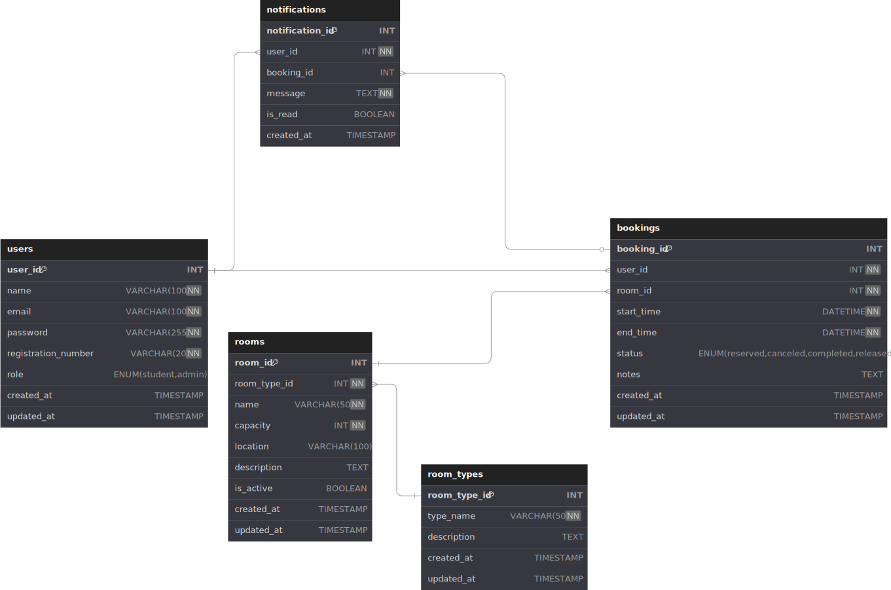

# Documento de Arquitetura Web (WAD)

## Sistema de Reserva de Salas - Inteli

## Introdução

O Sistema de Reserva de Salas do Inteli é uma aplicação web desenvolvida para atender às necessidades específicas da comunidade acadêmica do Instituto de Tecnologia e Liderança. O sistema permite que os estudantes reservem espaços de estudo no campus, que inclui 8 salas de estudo e 2 cabines para chamadas de vídeo.

### Objetivos do Sistema

- Facilitar o agendamento de salas de estudo e cabines para os estudantes
- Permitir reservas com duração flexível entre 15 minutos e 2 horas
- Possibilitar a liberação antecipada de salas quando não estiverem mais em uso
- Fornecer feedback em tempo real sobre a disponibilidade dos espaços
- Melhorar a utilização dos recursos de estudo disponíveis no campus

### Escopo

O sistema gerencia o processo completo de reserva de salas, desde a visualização de disponibilidade, criação de reservas, até a liberação de espaços. Ele é projetado especificamente para atender à comunidade do Inteli, utilizando autenticação com emails institucionais.

### Público-alvo

- Estudantes do Inteli que necessitam de espaços para estudo e reuniões
- Administradores do sistema responsáveis pela gestão dos espaços

## Diagrama do Banco de Dados

### Entidades Principais

1. **Users (Usuários)**

   - Armazena dados dos estudantes e administradores
   - Inclui informações de autenticação e perfil

2. **Room Types (Tipos de Salas)**

   - Categoriza os espaços disponíveis (sala de estudo, cabine)
   - Permite expandir para novos tipos de espaços no futuro

3. **Rooms (Salas)**

   - Representa os espaços físicos disponíveis para reserva
   - Vincula-se a um tipo específico de sala

4. **Bookings (Reservas)**

   - Registra os agendamentos feitos pelos usuários
   - Mantém o histórico de utilização dos espaços
   - Inclui status que permite liberação antecipada

5. **Notifications (Notificações)**
   - Sistema de comunicação com os usuários
   - Alerta sobre confirmações, cancelamentos e lembretes

### Relacionamentos

- Um usuário pode ter múltiplas reservas (1:N)
- Uma sala pode ter múltiplas reservas ao longo do tempo (1:N)
- Cada sala pertence a um tipo específico (N:1)
- Uma reserva pode gerar múltiplas notificações (1:N)
- Um usuário pode receber múltiplas notificações (1:N)

### Restrições Importantes

- Reservas devem ter duração mínima de 15 minutos e máxima de 2 horas
- Não é possível haver reservas sobrepostas para a mesma sala
- Apenas usuários com email institucional (@inteli.edu.br ou @sou.inteli.edu.br) podem fazer reservas
