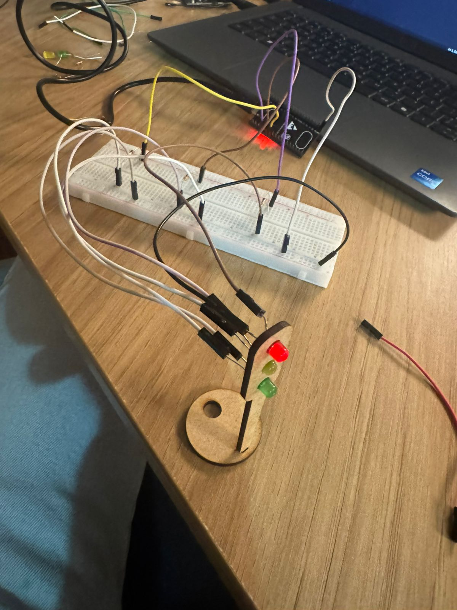
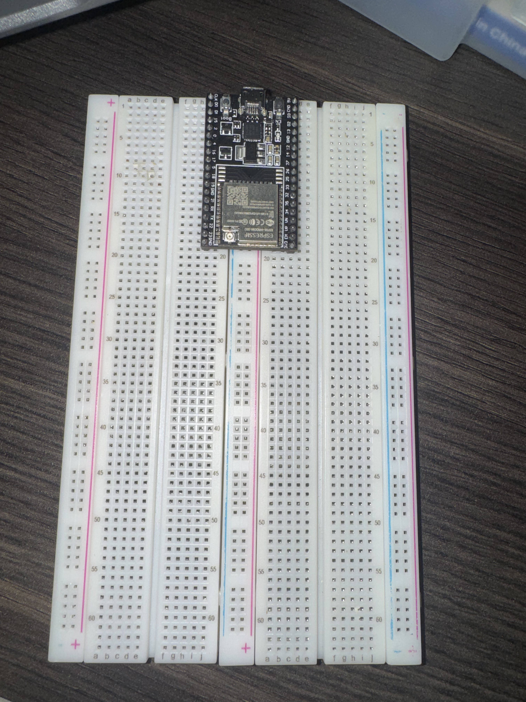
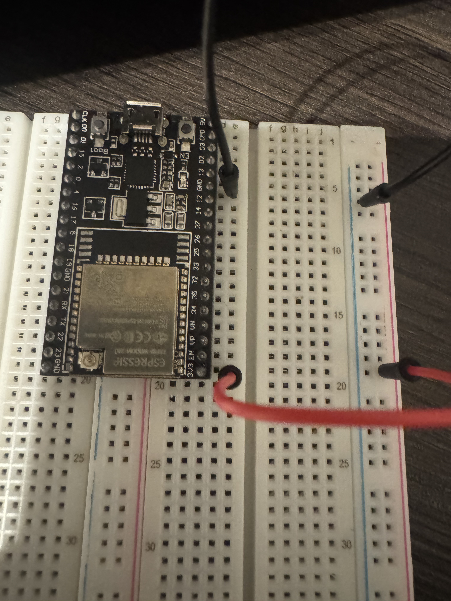
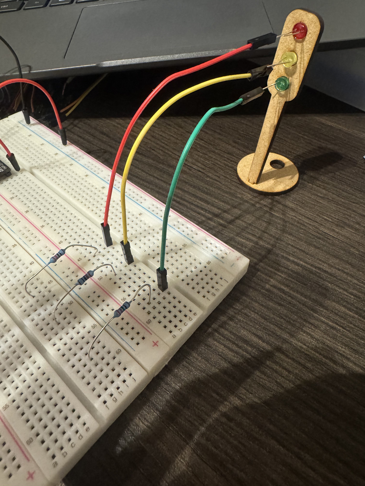
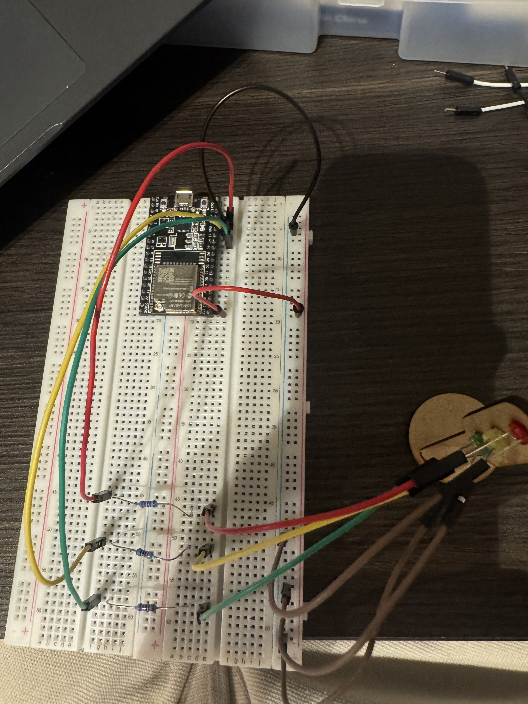
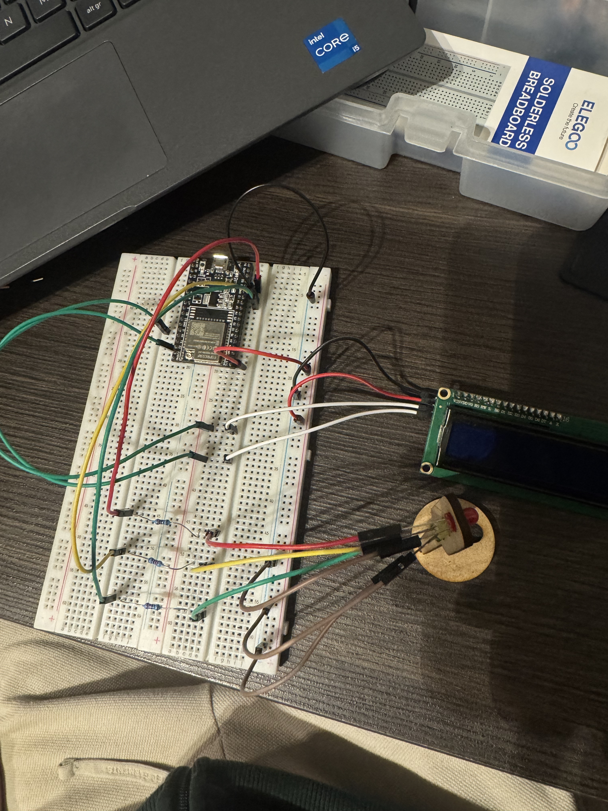

# Tutorial de Montagem

Guia passo a passo para montagem física do circuito na protoboard.

## Visão Geral

Este tutorial mostra como conectar três LEDs com resistores e um display LCD ao ESP32, criando um sistema de semáforo funcional.

<!-- INSTRUÇÕES: Foto da montagem completa de cima, com boa iluminação -->

---

## Passo 1: Posicionar o ESP32

Encaixe o ESP32 no centro da protoboard. Os pinos de cada lado devem ficar em trilhas diferentes para evitar curto-circuito.

<!-- INSTRUÇÕES: Foto do ESP32 sozinho na protoboard -->

**Por que assim?** O posicionamento central facilita o acesso aos pinos e permite distribuir os componentes ao redor dele de forma organizada.

---

## Passo 2: Conectar Alimentação

Conecte dois jumpers criando os barramentos de alimentação:
- Jumper vermelho: pino 3V3 do ESP32 -> barramento positivo
- Jumper preto: pino GND do ESP32 -> barramento negativo

<!-- INSTRUÇÕES: Foto mostrando os dois jumpers de alimentação -->

**Por que assim?** Os barramentos facilitam distribuir energia para todos os componentes sem precisar voltar sempre ao ESP32.

---

## Passo 3: Posicionar LEDs e Resistores

Posicione os três LEDs verticalmente na protoboard, de cima para baixo: vermelho, amarelo, verde. Conecte cada LED a um resistor de 220Ω.

**Atenção à polaridade:**
- Perna longa = anodo (positivo) -> conecta ao resistor
- Perna curta = catodo (negativo) -> conecta ao GND

<!-- INSTRUÇÕES: Foto dos três LEDs com resistores posicionados -->

**Por que assim?** Os resistores limitam a corrente para cerca de 15mA, protegendo os LEDs e o ESP32. Sem eles, os componentes podem queimar.

---

## Passo 4: Conectar LEDs ao ESP32

Conecte cada resistor ao pino GPIO correspondente:
- LED Vermelho -> GPIO 13
- LED Amarelo -> GPIO 12
- LED Verde -> GPIO 14

Conecte todos os catodos (perna curta) dos LEDs ao barramento GND.

<!-- INSTRUÇÕES: Foto mostrando todos os jumpers conectados -->

**Por que assim?** Usar jumpers de cores correspondentes aos LEDs facilita identificar e corrigir conexões caso necessário.

---

## Passo 5: Conectar Display LCD

Conecte os quatro pinos do display LCD:
- VCC -> barramento positivo
- GND -> barramento negativo
- SDA -> GPIO 21
- SCL -> GPIO 22

<!-- INSTRUÇÕES: Foto do display LCD conectado -->

**Por que assim?** O protocolo I2C usa apenas dois pinos de dados (SDA e SCL), economizando pinos GPIO. Os pinos 21 e 22 são os padrões do ESP32 para I2C.

---

## Passo 6: Verificar Conexões

Antes de ligar, verifique:
- Polaridade dos LEDs
- Valor dos resistores (220Ω)
- Todas as conexões firmemente encaixadas
- Sem fios soltos ou curtos-circuitos

<!-- INSTRUÇÕES: Foto em close dos barramentos mostrando organização -->

**Por que assim?** Verificar antes de energizar evita danos aos componentes e ao computador.

---

## Diagrama de Conexões

<!-- INSTRUÇÕES: Diagrama esquemático desenhado ou digital mostrando todas as conexões com números dos pinos -->

## Tabela de Conexões

| Componente | Pino do Componente | Conecta a |
|---|---|---|
| LED Vermelho | Anodo (longa) | Resistor 220Ω -> GPIO 13 |
| LED Vermelho | Catodo (curta) | Barramento GND |
| | | |
| LED Amarelo | Anodo (longa) | Resistor 220Ω -> GPIO 12 |
| LED Amarelo | Catodo (curta) | Barramento GND |
| | | |
| LED Verde | Anodo (longa) | Resistor 220Ω -> GPIO 14 |
| LED Verde | Catodo (curta) | Barramento GND |
| | | |
| Display LCD | VCC | Barramento 3V3 |
| Display LCD | GND | Barramento GND |
| Display LCD | SDA | GPIO 21 |
| Display LCD | SCL | GPIO 22 |
| | | |
| ESP32 | 3V3 | Barramento positivo |
| ESP32 | GND | Barramento negativo |

---

## Testando

Após carregar o código, observe:
- Ciclo correto: vermelho (6s) -> verde (4s) -> amarelo (2s)
- Display mostrando mensagens e contagem regressiva
- Apenas um LED aceso por vez

<!-- INSTRUÇÕES: Foto do semáforo funcionando, com LED aceso e display mostrando informação -->

### Problemas Comuns

**LED não acende:** Verifique polaridade e conexões.

**Display sem imagem:** Verifique endereço I2C (pode ser 0x3F ao invés de 0x27) e conexões SDA/SCL.

**Display com caracteres estranhos:** Ajuste o potenciômetro de contraste na parte traseira do módulo.

---

## Dicas

- Use fios do tamanho adequado para evitar bagunça
- Agrupe fios que vão para o mesmo destino
- Mantenha uma rota organizada seguindo os canais da protoboard
- Cores de fios ajudam na identificação visual

---

Para mais detalhes técnicos sobre o funcionamento do código, consulte [documentacao.md](doc/documentacao.md).